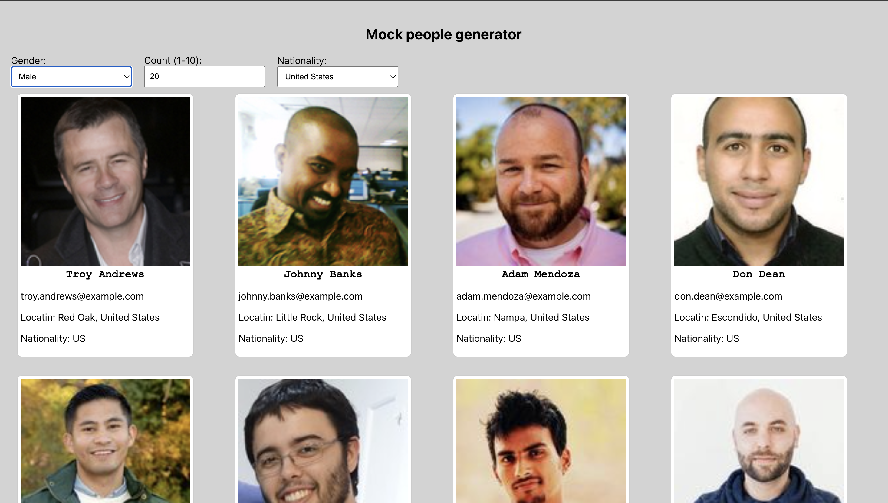
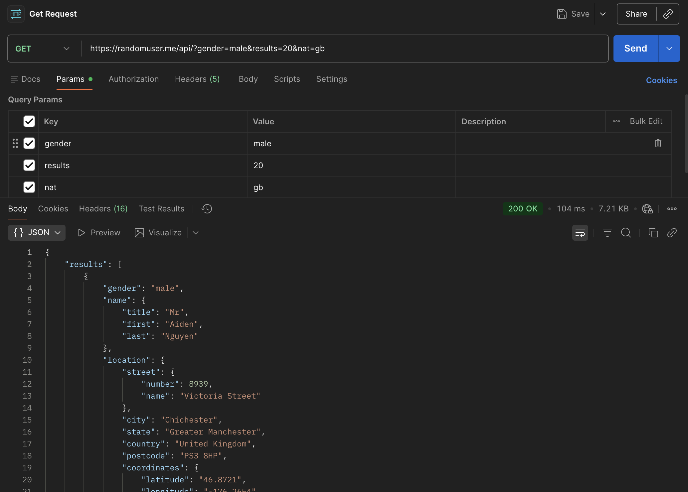

# LabTest2 COMP3123
+ Student: Evgenii Baldin
+ StudentID: 101435160

## Project
Mock person generator.  
Generation creteria: gender, nationality, count

API that was used: https://randomuser.me/  
API Docs: https://randomuser.me/documentation

## Instructions
1. Install dependencies:
```
   npm i
```
2. Start the application:
```
   npm run start
```

## Screenshots

### Web Application


### API Testing (Postman)



